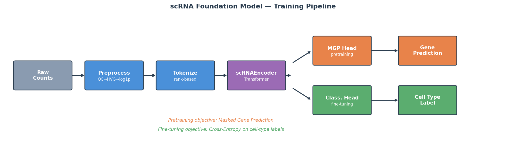
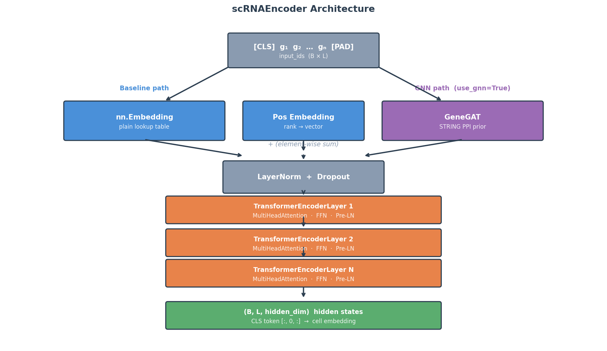
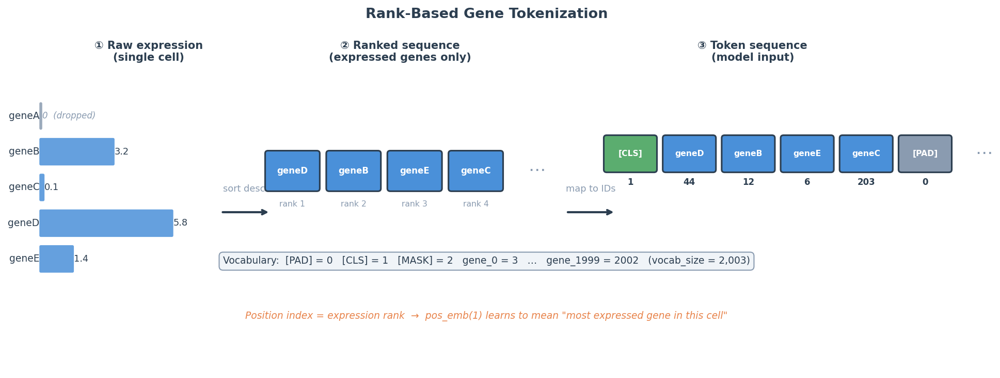
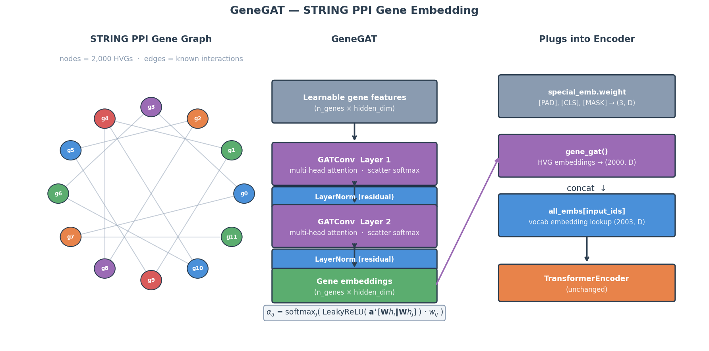

# PRISM

**PPI-augmented RNA Inference and Single-cell Modeling**

A hybrid **Transformer + GAT** foundation model for single-cell RNA-seq data. Pretrained with Masked Gene Prediction (MGP), then fine-tuned for cell-type classification. The protein-protein interaction (PPI) graph from STRING is used in two places: to produce biologically-informed gene embeddings (GeneGAT), and during classification itself (CellGAT head).

Inspired by Geneformer, scGPT, and scBERT. Benchmarked against scBiGNN and ACTINN on 7 standard datasets.

> **Scope note:** the original project brief specified a plain transformer (no graph
> component) with 5 ablation experiments and 3 references (Geneformer, scGPT, scBERT).
> The GeneGAT/CellGAT architecture, the scBiGNN/ACTINN benchmark suite, and 3 of the
> 8 ablations below (gene embeddings, GNN depth, classification head) extend beyond
> that brief — motivated by the GNN-in-single-cell-omics review cited below, which is
> the actual source for the graph-based design, not the original brief.

---

## Architecture




```
Input cell  →  [CLS] g₁ g₂ … gₙ  (ranked by expression, padded to max_seq_len)
                    ↓
       Gene Embedding  +  Rank (Position) Embedding
       ┌──────────────┴──────────────────┐
  nn.Embedding                      GeneGAT (Option A)
  (baseline)               STRING PPI prior → gene embeddings
       └──────────────┬──────────────────┘
                      ↓
           TransformerEncoder  (Pre-LN, GELU, N layers)
                      ↓
        ┌─────────────┴──────────────────────┐
   All positions                        CLS token
        ↓                                    ↓
MaskedGenePredHead              ┌─────────────┴──────────────┐
(pretraining)             CLS linear head          CellGAT head (Option B)
                          (baseline)          PPI GAT + attention pool
                                              (GNN-as-classifier)
```

**Default config (small):** hidden=256, layers=4, heads=4, ffn=1024, dropout=0.1

---

## Tokenization



Rank-based, as in Geneformer:
1. For each cell, take the top-2,000 HVGs after log-normalization.
2. Sort genes by descending expression → ordered token sequence.
3. Prepend `[CLS]`; pad/truncate to `max_seq_len=512`.
4. Gene index in the sequence **is** the positional encoding — expression rank is the biological prior.

Vocabulary: `[PAD]=0, [CLS]=1, [MASK]=2, gene_0=3, …, gene_1999=2002`

---

## Pretraining Objective

Masked Gene Prediction (MGP):
- Randomly mask 15% of non-`[CLS]` gene tokens → replace with `[MASK]`.
- Model predicts the original gene identity at each masked position.
- Loss = cross-entropy on masked positions only (`labels=-100` elsewhere).

---

## GNN Integration



The STRING PPI graph connects genes whose proteins physically interact (confidence ≥ 700).
PRISM uses this graph in two distinct ways:

### Option A — GeneGAT (gene embeddings)
Replaces the plain `nn.Embedding` table. A 2-layer GAT over the PPI graph produces
one context-aware embedding per gene before the transformer sees them.

| Condition | `use_gnn` | `gnn_freeze` | Description |
|---|---|---|---|
| Baseline | `False` | — | Plain `nn.Embedding`, learns from data only |
| GNN frozen | `True` | `True` | STRING prior baked in, GAT weights fixed |
| GNN joint | `True` | `False` | String prior + end-to-end fine-tuning |

### Option B — CellGAT head (GNN-as-classifier)
Closes the architectural gap with scBiGNN-style methods. Instead of reading only
the `[CLS]` token, gene hidden states from the transformer are:
1. Refined by a GATConv layer using PPI edges between co-expressed genes in each cell.
2. Pooled via learned attention → cell embedding → linear classifier.

Enable with `--head gat` in `benchmark_eval.py` or `ModelConfig(use_gat_head=True)`.

### Option C — CellGraph head (cell-cell GNN)
Options A and B both only ever model **gene-gene** structure — no PRISM variant
modeled **cell-cell** structure until this one, which is what scBiGNN's *bilevel*
design actually does (a gene-level GNN *and* a cell-level GNN, trained jointly via
EM). This is a cheaper approximation of that second half: a k-NN graph built from
cosine similarity between cell `[CLS]` embeddings **within the current training
batch** (not the full dataset — that would need an EM loop like scBiGNN's, which
this doesn't implement), refined by one GATConv layer, then classified.

Enable with `ModelConfig(use_cell_graph=True)` (`cell_graph_k` controls neighbors
per cell, default 5). First result (PBMC 3k, 3 seeds): beats the plain CLS head on
macro F1 (0.823 ± 0.021 vs 0.779 ± 0.072, tighter std too) but doesn't beat CellGAT
(0.847 ± 0.007) — Option B's gene-level PPI graph remains the strongest single
classification-time addition. See [Ablation Experiments](#ablation-experiments)
below for the full comparison.

---

## Quick Start

```bash
uv sync

# 1. Download PBMC data
uv run python data/download.py

# 2. Preprocess
uv run python data/preprocess.py

# 3. Pretrain
uv run python train/pretrain.py

# 4. Fine-tune (CLS head)
uv run python train/finetune.py

# 5. Fine-tune (GNN-as-classifier head)
uv run python train/finetune.py  # set ModelConfig(use_gat_head=True) in config

# 6. Full experiment with report
uv run python run_experiment.py
```

```bash
# Download all 10 benchmark datasets (same Zenodo archive)
uv run python data/download_benchmarks.py

# Run 5-fold CV against published baselines
uv run python train/benchmark_eval.py               # CLS head, no GNN vs scBiGNN / ACTINN
uv run python train/benchmark_eval.py --gnn frozen  # GeneGAT frozen (Option A)
uv run python train/benchmark_eval.py --gnn joint    # GeneGAT joint (Option A)
uv run python train/benchmark_eval.py --head gat    # CellGAT head (Option B)
uv run python train/benchmark_eval.py --dataset BaronHuman --epochs 20
```

---

## Benchmarks

7 datasets, all from the Abdelaal et al. 2019 Zenodo archive (3357167), evaluated via
`train/benchmark_eval.py` (5-fold CV, from-scratch supervised training — no MGP
pretraining transfer, matching how scBiGNN/ACTINN themselves are evaluated). All 7
verified: both their presence in that exact archive (confirmed by listing its full
contents directly) and their baseline numbers against the cited paper.

**Four architecture variants run below**, all on the same 7 datasets / 5-fold CV:
plain PRISM baseline (`use_gnn=False`, CLS head), GeneGAT frozen (Option A,
`gnn_freeze=True`), GeneGAT joint (Option A, `gnn_freeze=False`), and CellGAT head
(Option B, `use_gat_head=True`). See [GNN Variants on the Benchmark Suite](#gnn-variants-on-the-benchmark-suite)
below for the head-to-head comparison.

**Metrics — not all one type, read the Method column:**
- **scBiGNN** rows: baseline is **accuracy**, confirmed directly from Ma et al.'s
  Table 2 (caption: *"Classification accuracy of all the methods on the five
  datasets"*) — the 5 datasets in that table are exactly Zheng68K, Zhengsorted,
  BaronHuman, BaronMouse, AMB (our baseline numbers are an exact match to their
  bold `scBiGNN (p_θ)` row). PRISM's accuracy is the right comparison here.
- **ACTINN** rows (Segerstolpe, Muraro): scBiGNN's paper doesn't include these two
  datasets at all, so the 0.886/0.962 baselines must trace to **Abdelaal et al. 2019
  directly**, whose Methods section states its metric explicitly: *"For each cell
  population in the dataset, the F1-score is reported. The median of these F1-scores
  is used as a measure for the performance on the dataset."* Median F1 is their sole
  reported metric — so 0.886/0.962 are **median F1**, not accuracy. PRISM's median F1
  (not accuracy) is the correct comparison for these two rows.
- **median F1** here means the median (not mean) of per-class F1 scores — robust to
  one or two badly-performing rare classes dragging down a macro-average, which is
  exactly why Abdelaal et al. use it instead of accuracy or macro-F1. Computed in
  `eval/metrics.py` the same way: per-class F1 via `f1_score(average=None)`, then
  `np.median()` over classes.

| Dataset | Cells | Types | Baseline | Method | PRISM accuracy | PRISM median F1 | Δ |
|---|---|---|---|---|---|---|---|
| Zheng68K | 65,943 | 11 | 0.760 (acc) | scBiGNN | **0.840 ± 0.003** | 0.796 | ▲ 8.04% (acc) |
| Zhengsorted | 20,000 | 10 | 0.867 (acc) | scBiGNN | 0.821 ± 0.004 | 0.841 | ▼ 4.60% (acc) |
| BaronHuman | 8,569 | 14 | 0.983 (acc) | scBiGNN | 0.986 ± 0.002 | 0.983 | ▲ 0.25% (acc) |
| BaronMouse | 1,886 | 13 | 0.983 (acc) | scBiGNN | 0.959 ± 0.003 | 0.884 | ▼ 2.44% (acc) |
| AMB | 12,832 | 22 | 0.994 (acc) | scBiGNN | 0.989 ± 0.002 | 0.990 | ▼ 0.51% (acc) |
| Segerstolpe | 2,133 | 13 | 0.886 (median F1) | ACTINN | 0.972 ± 0.006 | 0.963 | ▲ 7.70% (median F1) |
| Muraro | 2,122 | 9 | 0.962 (median F1) | ACTINN | 0.978 ± 0.010 | 0.971 | ▲ 0.94% (median F1) |

Among the 5 scBiGNN rows (accuracy baseline), PRISM beats it on 2 of 5 (Zheng68K
+8.04pp, BaronHuman +0.25pp) and trails on 3 (Zhengsorted, BaronMouse, AMB), all
within ~0.5–4.6pp. One caveat: BaronMouse's accuracy (0.959) looks solid but median
F1 is much lower (0.884, mean macro F1 0.661) — a per-class breakdown shows the 5
largest classes (91% of the dataset) all score F1 ≥ 0.90, while the smallest classes
do badly (schwann, 6 cells, F1 = 0.000; T_cell, 7 cells, F1 = 0.25) — classic
class-imbalance masking, the same failure mode Abdelaal et al.'s median-F1 choice is
designed to catch. On the 2 ACTINN rows (median F1 baseline, now correctly matched
to PRISM's median F1), PRISM wins both: Segerstolpe +7.70pp, Muraro +0.94pp.

### GNN Variants on the Benchmark Suite

Same 7 datasets, 5-fold CV, same from-scratch supervised training — only the gene
embedding / classification head changes. Accuracy for all 4 variants:

| Dataset | Baseline | GNN frozen | GNN joint | CellGAT | Best variant |
|---|---|---|---|---|---|
| BaronHuman | 0.9855 | 0.9742 (▼1.13pp) | 0.9854 (▼0.01pp) | **0.9856** (▲0.01pp) | CellGAT (tied) |
| BaronMouse | 0.9586 | 0.9205 (▼3.81pp) | 0.9677 (▲0.91pp) | **0.9751** (▲1.65pp) | CellGAT |
| AMB | 0.9889 | 0.9778 (▼1.11pp) | 0.9890 (▲0.01pp) | **0.9914** (▲0.25pp) | CellGAT |
| Zheng68K | 0.8404 | 0.8293 (▼1.11pp) | **0.8429** (▲0.25pp) | 0.8383 (▼0.21pp) | GNN joint |
| Zhengsorted | **0.8210** | 0.7517 (▼6.93pp) | 0.7436 (▼7.74pp) | 0.8200 (▼0.10pp) | Baseline (tied w/ CellGAT) |
| Segerstolpe | 0.9723 | 0.9334 (▼3.89pp) | 0.9709 (▼0.14pp) | **0.9756** (▲0.33pp) | CellGAT |
| Muraro | **0.9779** | 0.9383 (▼3.96pp) | 0.9736 (▼0.43pp) | 0.9731 (▼0.48pp) | Baseline |

Three clear patterns:
- **GNN frozen (Option A) loses on all 7 datasets**, sometimes badly (Zhengsorted
  ▼6.93pp, Muraro ▼3.96pp, Segerstolpe ▼3.89pp). A STRING PPI prior baked into frozen
  gene embeddings, with no ability to adapt to the task, is a net negative here —
  the plain learned embedding table adapts better than a fixed biological prior.
- **GNN joint (Option A) is roughly a wash against baseline** — small wins on
  BaronMouse/Zheng68K/AMB, small losses on Segerstolpe/Muraro, **except Zhengsorted,
  where it craters (▼7.74pp)**, worse even than frozen. Something about this dataset's
  gene panel or class structure makes end-to-end GAT training actively harmful, not
  just neutral.
- **CellGAT head (Option B) is the strongest variant overall** — best or tied-best on
  5/7 datasets, and critically, **does not share frozen/joint's Zhengsorted collapse**
  (▼0.10pp, essentially noise, vs ▼6.93/▼7.74pp). Since CellGAT uses PPI edges during
  classification on top of transformer hidden states (not as the gene embedding
  itself), it isn't vulnerable to whatever makes a STRING-initialized embedding table
  fail on this dataset — the transformer's own representations carry the signal, and
  the GAT layer adds a task-relevant refinement rather than replacing the embedding.

Notes:
- The 5 scBiGNN baselines are verified exact matches against Ma et al.'s scBiGNN paper
  (arXiv:2312.10310, Table 2) — confirmed accuracy (table caption), confirmed those 5
  datasets only (Segerstolpe/Muraro aren't in scBiGNN's paper at all). Segerstolpe and
  Muraro's cell/type counts are corrected here against Abdelaal et al. 2019's actual
  Table 2 (previously listed as ~2,300/14 and ~2,100/9); their ACTINN values (0.886,
  0.962) are median F1 — confirmed via Abdelaal et al. 2019's Methods section, which
  states median F1-score as its sole reported metric (see Benchmarks metrics note
  above for the exact quote).
- **Zeisel, Macosko, and Klein were previously listed here** (attributed to "Abdelaal
  et al. 2019 (Zenodo 3357167)") but don't actually exist anywhere in that Zenodo
  archive — confirmed by listing its full directory contents (`Inter-dataset/`,
  `Intra-dataset/`, `Rejection/`, `Scalability/`, none of which contain these 3
  datasets) as well as by the earlier literature check that found them absent from
  both Abdelaal et al. 2019 and the scBiGNN paper. They're legitimate, widely-used
  datasets (Zeisel et al. 2015 *Science*; Macosko et al. 2015 *Cell*; Klein et al.
  2015 *Cell*) but from other sources entirely, so they were dropped from this
  benchmark suite rather than fetched from elsewhere and reported without a
  comparable baseline.
- `data/download_benchmarks.py`'s CSV loader streams each file in row chunks into a
  sparse matrix rather than loading it dense — the largest file here (Zheng68K,
  2.7 GB as text) expands to well over 10 GB as a naive dense float64 array, enough
  to OOM-kill the process on a 14 GB box; chunked+sparse loading keeps peak memory
  to roughly one chunk's size regardless of dataset size.

---

## Ablation Experiments

Run with `uv run python train/ablations.py` (or `--experiment NAME` for a single one).
Pretrain/fine-tune runs are cached on disk keyed by config **and seed**, so shared
baseline runs aren't recomputed across experiments or seeds. Results below are on
PBMC 3k (`pbmc3k_processed()`, 2,638 cells, 8 real expert-annotated cell types — CD4 T,
CD14+ Monocytes, B, CD8 T, NK, FCGR3A+ Monocytes, Dendritic, Megakaryocytes — not
unsupervised Leiden pseudo-labels), **mean ± std across 3 seeds** (42, 123, 7 — vary
model init + data shuffling only, not the train/val/test split itself); see
`experiments/ablations/summary.md` for the raw tables.

| Experiment | Variable | Metric | Result |
|---|---|---|---|
| Masking ratio | 5%, 15%, 25%, 40% | Test accuracy, macro F1 | Accuracy 0.908→0.909→**0.921**→0.914, macro F1 noisy (0.78–0.84) — 25% edges ahead but overlaps the others' std, no clear optimum |
| Tokenization | Rank-based vs raw expression bins | Embedding UMAP quality (silhouette) | Rank **-0.101 ± 0.020** vs expr_bin -0.089 ± 0.054 — sign flips vs the single-run result, but expr_bin's std is 2.5x rank's; noise-level difference, not a real edge either way |
| Model depth | 2 / 4 / 6 layers | Val loss, test accuracy, macro F1 | Val loss still falls monotonically with depth (6.52→6.35→6.19); accuracy non-monotonic (0.913→0.909→**0.914**) but macro F1 favors depth 6 clearly (0.824→0.779→**0.865**) — depth helps more than accuracy alone suggested |
| Pretrain vs scratch | Pretrained encoder vs random init | Test accuracy | Scratch (**0.914 ± 0.005**) still edges out pretrained (0.909 ± 0.011) — confirmed across 3 seeds, not a single-run fluke; MGP pretraining still isn't earning its cost on a dataset this small |
| Freeze vs fine-tune | Frozen encoder vs full fine-tune | Test accuracy, macro F1 | Full fine-tune **0.909 ± 0.011** vs frozen 0.597 ± 0.002 (macro F1 0.779 vs 0.194) — the tightest std of any result here (frozen's failure is consistent, not noisy) and by far the most decisive finding in the whole ablation suite |
| Gene embeddings | Baseline vs GNN frozen vs GNN joint | Test accuracy, macro F1, UMAP | GNN joint now **wins clearly**: accuracy 0.913 vs baseline 0.909, macro F1 0.799 vs 0.779, and silhouette 0.061 ± 0.039 vs baseline's -0.101 ± 0.020 — non-overlapping ranges. Frozen is worse on every metric (0.865 acc, 0.624 macro F1). **This reverses the single-run "did not replicate" verdict** — the joint-training embedding edge is real, just too small to see without averaging over seeds |
| GNN depth | GeneGAT at 1 / 2 / 3 layers (joint) | Test accuracy, macro F1, UMAP | Clean, consistent split: accuracy and macro F1 both fall monotonically with depth (0.918→0.913→0.905; 0.823→0.799→0.774), while silhouette *rises* monotonically (0.038→0.051→0.059). Follow-up check: neither classic over-smoothing nor simple overfitting explains this — train-split silhouette *also* rises with depth (0.083→0.116→0.114, not falling, ruling out over-smoothing), and the train/test silhouette gap doesn't widen monotonically either (0.040→0.057→0.047, ruling out a clean overfitting story). Best read: 2D UMAP silhouette and the classifier's use of the raw 256-dim embedding are measuring different things, and depth pulls them in opposite directions for reasons not yet isolated |
| Classification head | CLS linear vs CellGAT (PPI) vs CellGraph (cell k-NN) | Test accuracy, macro F1 | CellGAT wins outright: accuracy 0.912, macro F1 **0.847 ± 0.007** (tightest std of the three). CellGraph (Option C, new cell-cell k-NN head) beats CLS on macro F1 (0.823 ± 0.021 vs 0.779 ± 0.072) with much tighter std, but doesn't catch CellGAT — accuracy 0.908, in between the other two. Gene-level PPI-during-classification (Option B) remains the strongest single addition; cell-level (Option C) helps but less, at least in this batch-level approximation (no EM refinement over the full dataset, unlike scBiGNN's actual cell-cell graph) |

Notes:
- Switching from unsupervised Leiden clusters to `pbmc3k_processed()`'s real expert
  annotations changes both `data/download.py` (fetches `pbmc3k_processed()` instead of
  raw `pbmc3k()`) and `data/preprocess.py` (uses `.raw`, the pre-scaling log-normalized
  matrix, since `.X` on the processed object is already z-scored/clipped for PCA and
  isn't valid input for rank/expr_bin tokenization; also fixed a dormant labeling bug
  where the louvain→cell-type mapping assumed numeric cluster IDs but the real column
  already contains descriptive names like `"CD4 T cells"`).
- Adding 3 seeds (42, 123, 7) changed two conclusions from the single-run pass: gene
  embeddings' GNN-joint edge, which looked noise-level on one run, is consistent and
  non-overlapping once averaged; and GNN depth's silhouette-vs-accuracy relationship,
  which looked directionless on one run, is a clean monotonic split in both directions
  once averaged. Freeze-vs-fine-tune and pretrain-vs-scratch were already solid on a
  single run and stayed solid with tight std across seeds. Masking ratio and
  tokenization remain genuinely inconclusive — their std is wide enough that no
  configuration is confidently better than another.
- **Classification head's third condition, "cellgraph"**, was added after
  cross-referencing the same GNN-in-single-cell-omics review that motivated the
  gnn_depth experiment — it flagged that PRISM had no cell-cell graph component at
  all (Options A and B both only model gene-gene structure), unlike scBiGNN's
  bilevel (gene-level + cell-level) design. `CellGraphClassificationHead`
  (`model/heads.py`) + `CellCellGAT` (`model/gnn.py`) close part of that gap with a
  k-NN graph over cell `[CLS]` embeddings, built fresh from cosine similarity within
  each training batch — a cheaper approximation of scBiGNN's actual cell-cell graph,
  which is built once over the *entire* dataset via an EM loop. Adding these fields
  to `ModelConfig` changed the config hash for every cached experiment (even
  unrelated ones at default values), so re-running the full 8-experiment suite from
  here will retrain everything rather than hitting the old cache — a one-time cost,
  not a recurring one.
- All numbers above are from the stratified train/val/test split (see `data/dataset.py`'s
  `load_datasets()`) with the corrected STRING edge-weight normalization (see
  `model/gene_graph.py`) — gene-embedding and CellGAT experiments run against live
  STRING PPI data, not the co-expression fallback. Only `PretrainConfig.seed` /
  `FinetuneConfig.seed` vary across the 3 seeds (model init + data shuffling) —
  `DataConfig.seed` (the train/val/test split itself) stays fixed at 42 for all of them,
  so every seed sees identical splits.
- `val_loss` is only comparable *within* an experiment, not between tokenization
  schemes: rank predicts over the full gene vocabulary (~2,000-way) while expr_bin
  predicts over expression bins (11-way), so their losses live on different scales.

---

## Project Structure

```
prism/
├── data/
│   ├── download.py              # Fetch PBMC 3k / 10k
│   ├── preprocess.py            # QC → normalize → HVG → labels
│   ├── dataset.py               # PyTorch Dataset with rank tokenization + masking
│   ├── download_benchmarks.py   # Download 10 benchmark datasets from Zenodo
│   └── benchmark_utils.py       # Preprocessing + k-fold splits for benchmarks
├── model/
│   ├── tokenizer.py             # GeneVocab: gene ↔ token id mapping
│   ├── transformer.py           # scRNAEncoder (BERT-style, supports GNN embedding)
│   ├── heads.py                 # MGP head, CLS head, CellGAT head
│   ├── gnn.py                   # GATConv + GeneGAT (STRING PPI gene embeddings)
│   └── gene_graph.py            # STRING API fetch, co-expression fallback
├── train/
│   ├── config.py                # DataConfig / ModelConfig / PretrainConfig / FinetuneConfig
│   ├── pretrain.py              # MGP pretraining loop
│   ├── finetune.py              # Supervised cell-type classification
│   └── benchmark_eval.py        # 5-fold CV on 10 benchmark datasets
├── eval/
│   ├── metrics.py               # Accuracy, F1, confusion matrix
│   └── visualise.py             # UMAP of CLS embeddings
├── notebooks/
│   ├── 01_data_exploration.ipynb
│   ├── 02_pretraining_curves.ipynb
│   └── 03_ablations.ipynb
├── experiments/                 # Per-run logs, UMAP plots, reports
├── run_experiment.py            # Full pipeline runner
└── checkpoints/
```

---

## References

- **Geneformer** — Theodoris et al., "Transfer learning enables predictions in network biology," *Nature* 618:616–624, 2023. Rank-based gene tokenization. [doi.org/10.1038/s41586-023-06139-9](https://doi.org/10.1038/s41586-023-06139-9)
- **scGPT** — Cui et al., "scGPT: toward building a foundation model for single-cell multi-omics using generative AI," *Nature Methods*, 2024. Generative pretraining on scRNA. [doi.org/10.1038/s41592-024-02201-0](https://doi.org/10.1038/s41592-024-02201-0)
- **scBERT** — Yang et al., "scBERT as a large-scale pretrained deep language model for cell type annotation of single-cell RNA-seq data," *Nature Machine Intelligence* 4, 2022. BERT for scRNA. [doi.org/10.1038/s42256-022-00534-z](https://doi.org/10.1038/s42256-022-00534-z)
- **scBiGNN** — Ma et al., "scBiGNN: Bilevel Graph Representation Learning for Cell Type Classification from Single-cell RNA Sequencing Data," 2023. Bipartite GNN for cell-type annotation (direct baseline). [arxiv.org/abs/2312.10310](https://arxiv.org/abs/2312.10310)
- **ACTINN** — Ma & Pellegrini, "ACTINN: automated identification of cell types in single cell RNA sequencing," *Bioinformatics* 36(2):533–538, 2020. Supervised neural network baseline. [doi.org/10.1093/bioinformatics/btz592](https://doi.org/10.1093/bioinformatics/btz592)
- **STRING** — Szklarczyk et al., "The STRING database in 2023: protein-protein association networks and functional enrichment analyses for any sequenced genome of interest," *Nucleic Acids Research* 51(D1):D638–D646, 2023. PPI network. [doi.org/10.1093/nar/gkac1000](https://doi.org/10.1093/nar/gkac1000)
- **GAT** — Veličković et al., "Graph Attention Networks," *ICLR* 2018. [arxiv.org/abs/1710.10903](https://arxiv.org/abs/1710.10903)
- **GNNs for single-cell omics** — Li, Hua & Chen, "Graph neural networks for single-cell omics data: a review of approaches and applications," *Briefings in Bioinformatics* 26(2):bbaf109, 2025. The actual source for PRISM's GeneGAT/CellGAT design (PPI-informed gene embeddings, GAT-based classification) and for the GNN-depth ablation's over-smoothing motivation — not the original project brief, which specified a plain transformer only. [doi.org/10.1093/bib/bbaf109](https://doi.org/10.1093/bib/bbaf109)
- **Abdelaal et al.** — "A comparison of automatic cell identification methods for single-cell RNA sequencing data," *Genome Biology* 20:194, 2019. Benchmark suite (Zenodo 3357167). [doi.org/10.1186/s13059-019-1795-z](https://doi.org/10.1186/s13059-019-1795-z)
